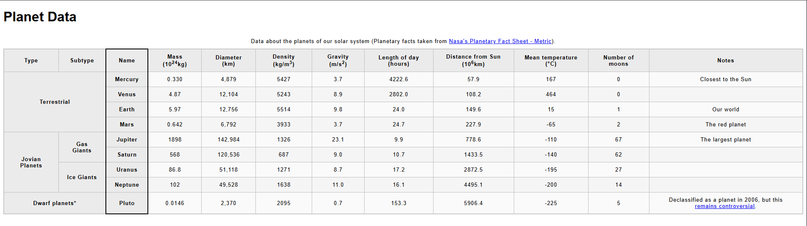

# Tables

Practice using table elements to display data.

Completed as part of the **Intermediate HTML and CSS** section of the **Full Stack JavaScript** path at [TheOdinProject](https://www.theodinproject.com).

---

## Assignment

From MDN's [Challenge: Structuring a planet data table](https://developer.mozilla.org/en-US/docs/Learn_web_development/Core/Structuring_content/Planet_data_table):

> ###  Project Brief
> You are working at a school; currently your students are studying the planets of our solar system, and you want to provide them with an easy-to-follow set of data to look up facts and figures about the planets. An HTML data table would be ideal — you need to take the raw data you have available and turn it into a table.

The challenge provides the following as starting points:

- [blank-template.html &rArr;](https://github.com/mdn/learning-area/blob/main/html/tables/assessment-start/blank-template.html)
- [minimal-table.css &rArr;](https://github.com/mdn/learning-area/blob/main/html/tables/assessment-start/minimal-table.css)
- [planets-data.txt &rArr;](https://github.com/mdn/learning-area/blob/main/html/tables/assessment-start/planets-data.txt)

> [!NOTE]NOTES
> - The challenge includes a seven step process to follow to completion. As per usual, I will ignore it.
> - `planets-data.txt` has been rendered [locally](./planets-data.md) using markdown for better readability.

## Results



Pretty easy overall. However, reading through the *Hints and tips* once I thought I was done - to check if I had missed anything revealed:

> One way of associating headers with their rows/columns is a lot easier than the other way.

Having no idea what was being referenced I inspected the example source code revealing two interesting features -

1. While I was quite happy with my use of css pseudo-classes to efficiently target the name column and style its border, a `<colgroup>` would have been even more so -
    ```html
    <table>
        <caption>...</caption>
        <colgroup>
            <col span="2">
            <col style="border: 2px solid black;">
            <col span="9">
        </colgroup>
        ...
    </table>
    ```
2. While some elements are unnecessary for the visual formatting of a table their inclusion is best practice to increase accessibility for those who rely on screen readers. This applies to `<thead>` and `<tbody>` elements and the inclusion of a `scope` property if using a `<th>` as a row heading -
    ```html
    <th scope="row">Row Heading</th>
    ```
